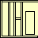

<p align="center">
    
</p>

#  LetThereBeDark

[](https://github.com/MartinKondor/LetThereBeDark) [](https://github.com/MartinKondor/LetThereBeDark)  [](https://github.com/MartinKondor/LetThereBeDark/issues)

Browser extension for making any page dark styled.

## Getting Started

1. Clone or download this repository.
2. Setup the extension in your browser:
    * Firefox:
        1. Type in **about:debugging** to the url bar and hit enter.
        2. Go to **This Firefox**.
        3. Click on **Load Temporary Add-on**.
        4. Choose **manifest.json** file from this extension's folder.
    * Chrome:
        1. Type in **chrome://extensions/** to the url bar and hit enter.
        2. Turn on **Developer mode** in the right hand corner.
        3. Click on **Load unpacked extension ...**.
        4. Choose this extension's folder.

## Contributing

Ways to contribute:

* Check for open issues
* Read the ```TODO``` file

### Steps

1. Fork this repository
2. Create a new branch (optional)
3. Clone it
4. Make your changes
5. Upload them
6. Make a pull request here

## Authors

* **[Martin Kondor](https://github.com/MartinKondor)**

<p align="center">
<a title="Fiverr" href="https://www.fiverr.com/martinkondor">

</a>
</p>

<p align="center"><a href="https://www.patreon.com/bePatron?u=17006186" data-patreon-widget-type="become-patron-button"></a></p>

## License

Copyright &copy; Martin Kondor 2020

This repository is licensed under the ```MIT``` license.
See the [LICENSE](./LICENSE) file for more details.

